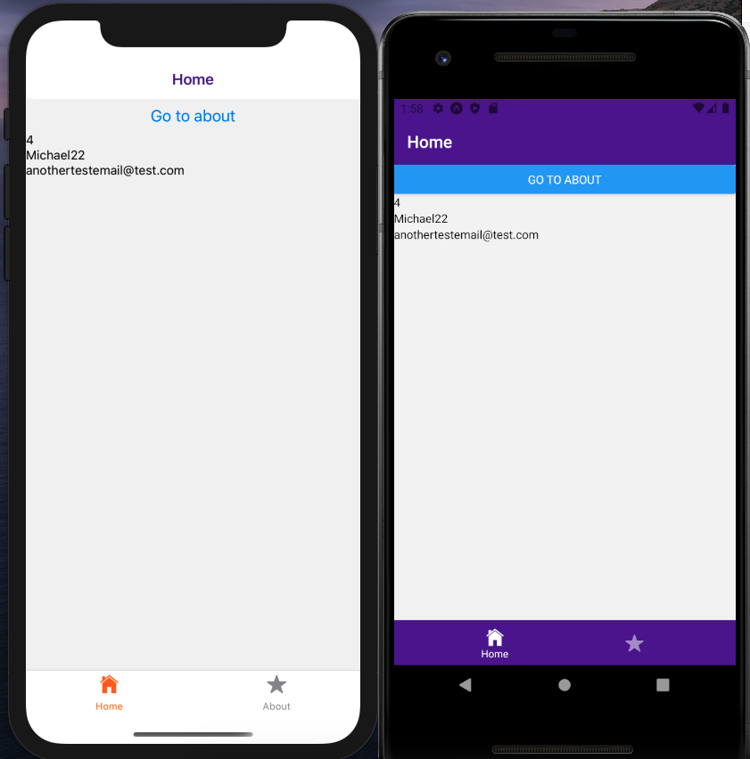

# Setup for React-native, TypeScript, Redux-Saga, React-navigation(V4)

**_DEMO:_**



## Usage / Install

Clone repo, cd into folder and run:

```console
$ yarn
$ yarn start
```

## Requirement

- npm (Node) / yarn

## Already Installed dependencies

1. `expo init rn-ts-redux-saga-boiler`
2. `yarn add react-navigation`
3. `expo install react-native-gesture-handler react-native-reanimated react-native-screens react-native-safe-area-context @react-native-community/masked-view`
4. `yarn add react-navigation-stack @react-native-community/masked-view`
5. `yarn add redux redux-saga react-redux`
6. `yarn add -D eslint jest @react-native-community/eslint-config @types/react-redux`
7. `yarn add eslint-config-react-native-wcandillon --dev`
8. `yarn add react-navigation-material-bottom-tabs react-navigation-tabs @expo/vector-icons react-native-paper expo-font`

## Licence

[MIT](./LICENSE.txt)
